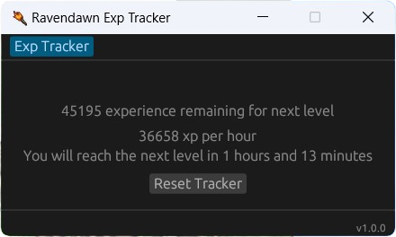
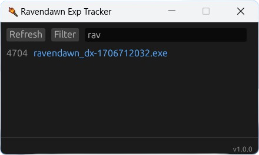
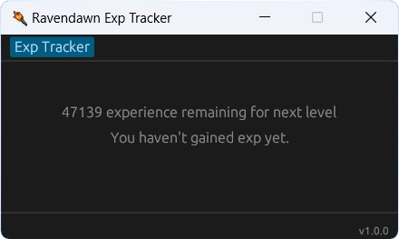
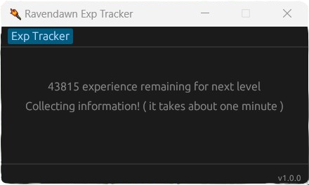

<h1 align="center">
  <picture>
    
  </picture>
</h1>

<div align="center">


</div>

<h3 align="center">
  Revendawn Tools - <a href="https://github.com/vtorres/ravendawn-tools-private/blob/main/ravendawn.CT">Cheat Table</a> and <a href="https://github.com/vtorres/ravendawn-tools-private/releases/tag/1.0.0">Exp Tracker</a>
</h3>

<div align="center">
  <picture>
    
  </picture>
</div>

### 📖 About

Ravendawn Online stands as a massively multiplayer online role-playing game (MMORPG) crafted by Tavernlight Games. It's interesting to dive into the details of its development since they've utilized the complete source code, networking protocol, and various components directly from Tibia. To be more precise, they've integrated well-known open-source elements such as [otclient](https://github.com/edubart/otclient) and expanded upon them. It adds a touch of humor to the situation when the developers express frustration at labeling the game as a mere Tibia-like. Let's steer clear of that debate and instead focus on exploring and enhancing the game!

### 📖 How to find the right memory address for the Entity

CT File: [Enjoy it!](https://github.com/vtorres/ravendawn-tools-private/blob/main/ravendawn.CT)

Discovering the Entity Address in this game can be achieved through various methods, with the most straightforward approach involving the player's cardinal directions (North, East, South, and West). By following this advice, one can identify the Entity's base address in under a minute. The directional values are as follows: North (0), East (1), South (2), and West (3).

Having this fundamental information will save you a significant amount of time. Let's get started!

Log in to your account character, attach Cheat Engine, and orient your character to face North. Scan the memory for the value 0. Now, you can systematically alternate directions and filter the results using the provided directional values.
The process is quite straightforward, and after a few repetitions of these steps while filtering the memory, you'll be able to pinpoint it in less than a minute. Once you've identified the direction memory, initiate a pointer scan with a depth of one. This will yield essentially one result, simplifying the task. Removing this offset and obtaining the base address is the ultimate goal – the Entity itself!
After discovering the Entity base address and examining the Memory View, you'll notice that everything we need is readily available and not too distant from the base address. This includes crucial data such as Current HP, Current SP, Max HP, Max Mana, Directions, Outfits, Player Name, Coordinates (x, y, z), Current XP, Lights, Player ID, Monster ID (the target we are attacking), and much more. Armed with this information, you can easily implement features like Cave Light, Outfit Changer, Exp tracker, Bots, and more.

I refrain from implementing functionalities that completely disrupt the game, such as instant mining, instant fishing, and worse. My intention here is to provide fundamental information, allowing you to explore further on your own! However, when it comes to opening the source code to the community, things can take a negative turn. If you're inclined to break the game, here's a [little tip](https://github.com/vdsk/ravendawn-decrypt) on decrypting the Lua files of the game and altering its behavior entirely according to your preferences.

Now that we are at the same page, I am going to implement the most useless and not invasive tool to the community and myself.

### 🤖 Ravendawn Exp Tracker [Download](https://github.com/vdsk/ravendawn-decrypt)

Occasionally, you might desire additional insights into your in-game hunting, such as the average EXP per hour and the time remaining until the next level. Given the current absence of this information in the game, we have to take matters into our own hands.

<div align="center">
  <picture>
    
  </picture>
</div>

<table>
  <tr>
    <td>Processes</td>
    <td>Haven't made XP Yet</td>
    <td>Collecting information</td>
  </tr>
  <tr>
    <td valign="top"></td>
    <td valign="top"></td>
    <td valign="top"></td>
  </tr>
 </table>

### 📕 Prerequisites

- [Rust](https://www.rust-lang.org/tools/install)

### 🖥️ Development

```shell
  cargo update stable
```

Open the ravendawn-xp-tracker folder and run the command below:

```shell
cargo run
```
or

```shell
cargo build --release
```

### 🏴‍☠️ Credits

- [Vitor Torres](https://github.com/vtorres/)